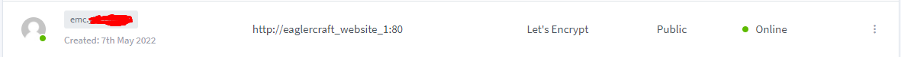
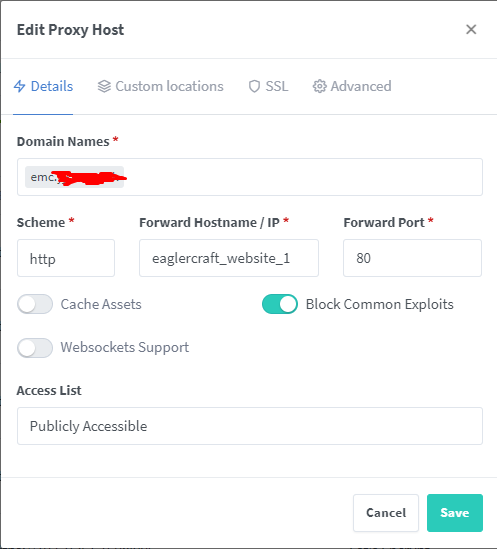
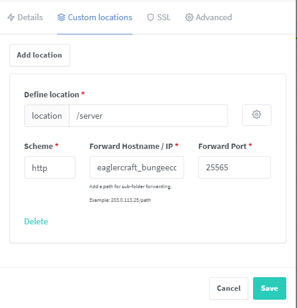
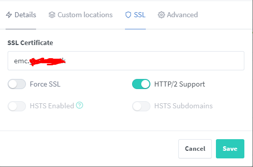

# Example of docker-compose

This folder contains a sample of a docker-compose.yml. Feel free to use and edit it!

Keep in mind that I am using [nginx proxy manager](https://nginxproxymanager.com), and I have skipped out on some ports to be exposed.

I recommend using nginx proxy manager, but if you decide against it you will need to expose the website and bungeecord's ports.

If you are using nginx proxy manager, here are some screenshots of my proxy host:

*we dont talk about screenshot_73*
